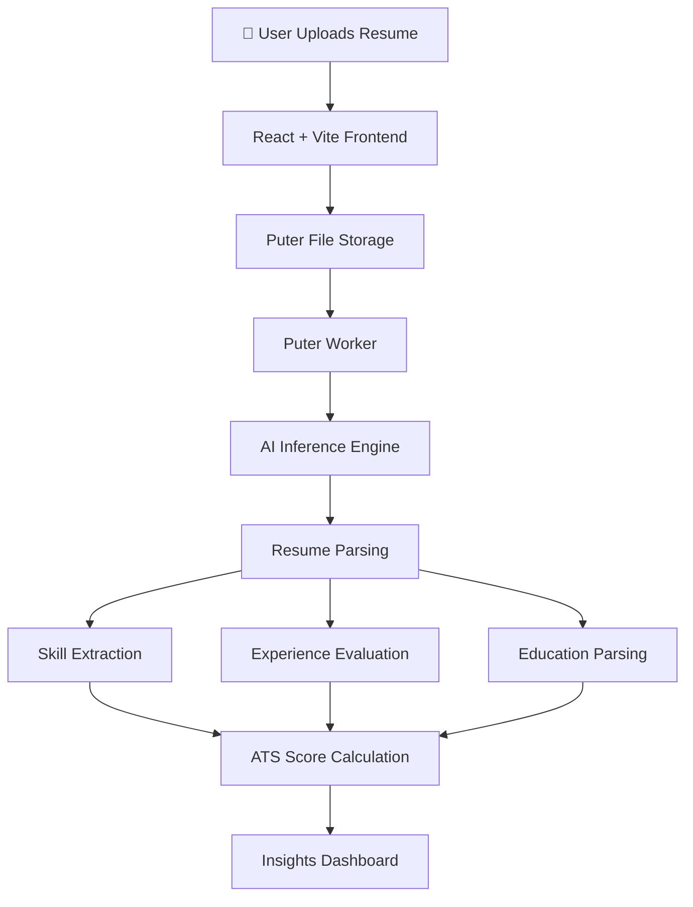

<div align="center">

# 🔎 Resumind

### AI-Powered Resume Insights & ATS Analysis Platform

**A modern resume analysis platform that evaluates resumes using AI to provide ATS scores, skill extraction, experience analysis, and improvement suggestions.**
*Upload your resume and receive intelligent insights instantly.*

<br>

[](https://react.dev/)
[](https://vitejs.dev/)
[](https://reactrouter.com/)
[](https://puter.com/)
[](https://www.docker.com/)
[]()

</div>

---

# 🌐 Live Demo

🚀 **Try Resumind here:**
👉 [https://marshmello-resumind.vercel.app/](https://marshmello-resumind.vercel.app/)

---

# 📖 What is Resumind?

Resumind is an **AI-powered resume analysis platform** that helps users evaluate their resumes using intelligent AI models.

Instead of manually reviewing resumes or relying on basic ATS checkers, Resumind provides **deep AI-driven insights** including:

* ATS compatibility scoring
* Skill extraction
* Experience evaluation
* Resume structure analysis
* Improvement suggestions

The system uses **Puter.js** to provide a **fully serverless backend**, handling:

* file storage
* resume parsing
* AI inference
* worker execution

This eliminates the need for traditional backend infrastructure while maintaining scalability and performance.

---

# ✨ Features

| Feature                        | Description                                     |
| ------------------------------ | ----------------------------------------------- |
| 📄 **Resume Upload**           | Upload resumes in PDF, DOCX, or TXT format      |
| 🤖 **AI Resume Analysis**      | Extracts structured insights from resumes       |
| 📊 **ATS Score Calculation**   | Evaluates resume compatibility with ATS systems |
| 🧠 **Skill Extraction**        | Automatically detects technical and soft skills |
| 💼 **Experience Breakdown**    | Analyzes professional experience                |
| 📈 **Improvement Suggestions** | AI-generated resume optimization advice         |
| ⚡ **Serverless Architecture**  | Powered by Puter.js workers                     |

---

# 🏗️ System Architecture

### Resume Analysis Pipeline



---

# 🛠️ Technology Stack

### Frontend

| Component  | Technology       |
| ---------- | ---------------- |
| Framework  | `React 18`       |
| Build Tool | `Vite`           |
| Routing    | `React Router 7` |
| Styling    | `CSS`            |

---

### Backend (Serverless)

| Component          | Technology           |
| ------------------ | -------------------- |
| Serverless Backend | `Puter.js`           |
| File Storage       | Puter Storage        |
| AI Inference       | Puter AI Workers     |
| Resume Parsing     | Custom parsing logic |

---

### DevOps

| Component        | Technology   |
| ---------------- | ------------ |
| Deployment       | Vercel       |
| Containerization | Docker       |
| Version Control  | Git + GitHub |

---

# ⚙️ How It Works

Resumind follows a **serverless AI pipeline**:

1️⃣ **Resume Upload**

User uploads a resume file.

Supported formats:

* PDF
* DOCX
* TXT

---

2️⃣ **File Processing**

Puter.js handles:

* secure file storage
* temporary file access
* worker execution

---

3️⃣ **AI Analysis**

AI models analyze the resume to extract:

* skills
* experience
* education
* key achievements

---

4️⃣ **ATS Scoring**

The system calculates an **ATS compatibility score** based on:

* keyword density
* formatting
* section completeness

---

5️⃣ **Insight Dashboard**

Results are presented through interactive UI components such as:

* score gauges
* badges
* resume summaries
* improvement recommendations

---

# 📂 Project Structure

```text
AI-Resume-Analyzer/
│
├── app/
│   ├── components/
│   │   ├── FileUploader.tsx
│   │   ├── ResumeCard.tsx
│   │   ├── ScoreGauge.tsx
│   │   ├── ScoreCircle.tsx
│   │   ├── ScoreBadge.tsx
│   │   ├── ATS.tsx
│   │   ├── Details.tsx
│   │   └── Summary.tsx
│   │
│   ├── lib/
│   │   ├── puter.ts
│   │   ├── pdf2img.ts
│   │   └── utils.ts
│   │
│   ├── routes/
│   │   ├── home.tsx
│   │   ├── upload.tsx
│   │   ├── resume.tsx
│   │   └── auth.tsx
│   │
│   ├── root.tsx
│   └── app.css
│
├── constants/
│   └── index.ts
│
├── public/
│   ├── screenshot-1.png
│   ├── screenshot-2.png
│   └── screenshot-3.png
│
├── types/
│   ├── index.d.ts
│   └── puter.d.ts
│
├── package.json
└── README.md
```

---

# 🚀 Installation & Setup

### Prerequisites

* Node.js 18+
* npm or yarn

---

# 1️⃣ Clone the Repository

```bash
git clone https://github.com/kishorekrrish3/AI-Resume-Analyzer.git
cd AI-Resume-Analyzer
```

---

# 2️⃣ Install Dependencies

```bash
npm install
```

---

# 3️⃣ Run Development Server

```bash
npm run dev
```

---

# 🌐 Local Development

Open in browser:

```
http://localhost:5173
```

---

# 🔐 Environment Variables

Create a `.env` file in the root directory.

```env
PUTER_API_KEY=your_api_key
PUTER_WORKER_ID=your_worker_id
VITE_APP_BASE_URL=http://localhost:5173
```

Note: Many Puter features work without requiring API keys.

---

# 🐳 Docker Support

### Build Docker Image

```bash
docker build -t ai-resume-analyzer .
```

---

### Run Container

```bash
docker run -p 3000:3000 ai-resume-analyzer
```

---

# 🚀 Deployment

Resumind can be deployed using:

### Vercel

1. Push project to GitHub
2. Import repository into Vercel
3. Configure environment variables
4. Deploy

---

### Puter Platform

1. Open Puter Dashboard
2. Connect GitHub repository
3. Upload build folder
4. Deploy instantly

---

# 🛣️ Roadmap

Future improvements planned for Resumind:

* Resume version history
* Multi-page resume analysis
* PDF export for analysis results
* User authentication & dashboards
* Multiple LLM model support
* Analytics integration (PostHog)

---

# 🤝 Contributing

Contributions are welcome.

1. Fork the repository
2. Create a feature branch
3. Commit your changes
4. Open a pull request

---

# 👨‍💻 Author

**Kishore P**
AI & ML Enthusiast • Full-Stack Developer
CSE (AI & Robotics) — VIT Chennai

---

<div align="center">

<br>

<i>Helping professionals build stronger resumes using AI.</i>

<br><br>

**Resumind** — smarter resumes, better opportunities.

</div>
